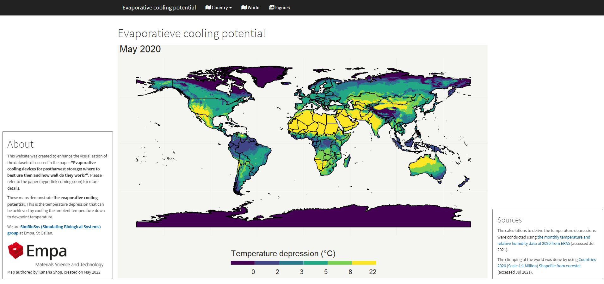

# Evaporative cooling potential map

# About
This website (https://empasimbiosys.github.io/evapo_cooling_map/) was created to enhance the visualization of the datasets discussed in the paper <b>"Evaporative cooling devices for postharvest storage: where to best use then and how well do they work?"</b>. Please refer to the paper (DOI: https://doi.org/10.31224/2334) for more details.

 
  
 
We are <a href="https://www.empa.ch/web/simbiosys/overview" target="_blank"><b>SimBioSys (Simulating Biological Systems) group</b></a> at Empa, St Gallen.

 
